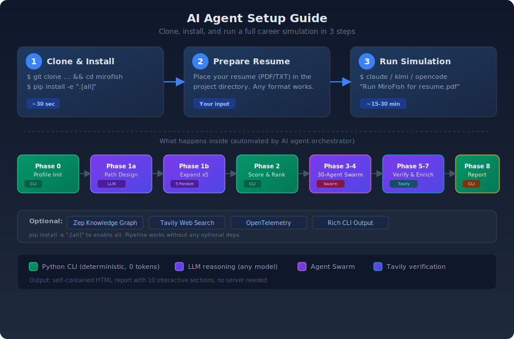
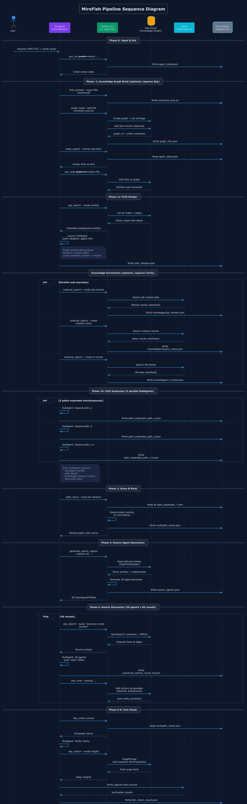

# MiroFish

AI Career Simulator powered by AI coding agents.

Simulate 10-year career trajectories with multi-path analysis, social sentiment simulation, and detailed HTML reports. Works with any AI coding agent -- Claude Code, Kimi Code, OpenCode, and more.

<div align="center">

<br/>
<em>Full pipeline: profile init, path design, 5-way expansion, scoring, 30-agent swarm, HTML report</em>
</div>

## What It Does

Input a resume and career context. MiroFish generates a comprehensive career simulation report covering:

- **5 parallel career paths** with best/likely/base/worst scenarios per path
- **10-year income projections** with interactive charts
- **30 AI agents** discussing your career choices from different perspectives
- **Fact-checked claims** against real market data
- **Reskilling recommendations** prioritized by cross-path impact

### Report Output

<div align="center">

<br/>
<em>Self-contained HTML report with 10 interactive sections</em>
</div>

### Report Sections

<table>
<tr>
<td width="50%"><br/><b>01 Profile</b> - Candidate overview with career history, skills, and financials</td>
<td width="50%"><br/><b>02 Core Skills</b> - Fundamental strengths identified by 30 swarm agents</td>
</tr>
<tr>
<td><br/><b>03 God's Eye View</b> - 5 paths x 3 scenarios with probability-weighted scoring</td>
<td><br/><b>04 Income Projections</b> - 10-year salary trajectories across all paths</td>
</tr>
<tr>
<td><br/><b>05 Career Paths</b> - Period-by-period breakdown with events, blockers, and agent commentary</td>
<td><br/><b>06 Reskilling</b> - Skills prioritized by cross-path relevance</td>
</tr>
<tr>
<td><br/><b>07 Parallel Self</b> - How your parallel-world selves would view each other</td>
<td><br/><b>08 External Voices</b> - 30 AI agents discuss each career path</td>
</tr>
<tr>
<td><br/><b>09 Macro Trends</b> - Industry trends and labor market risks</td>
<td><br/><b>10 Knowledge Graph</b> - Interactive visualization of career entity relationships</td>
</tr>
</table>

## Origin

This project is a fork of [666ghj/MiroFish](https://github.com/666ghj/MiroFish) reimplemented for AI coding agents.

**What we kept from the original:**
- Domain models: `BaseIdentity`, `CareerState`, life event definitions
- Core engines: `LifeEventEngine`, `BlockerEngine` (6-category career blockers)
- Zep knowledge graph integration for candidate memory
- OASIS-inspired social simulation concepts

**What changed:**
- Replaced OpenAI + Flask backend with Claude Code SubAgent orchestration
- Removed frontend (Vue.js) and Docker -- output is a self-contained HTML report
- Added multi-path expansion (5 paths x 4 scenarios = 20 trajectories)
- Added SNS Agent Swarm (30 AI characters discussing career decisions)
- Added Pydantic v2 data contracts with normalizer layer for LLM output variance
- Added fact-checking pipeline (Tavily) and macro trend analysis
- Packaged as standalone Python CLI (`cc_layer`)

## AI Agent Setup (One-Push)

<div align="center">

</div>

### 3 Steps to Run

```bash
# 1. Clone & Install
git clone https://github.com/minicoohei/mirofish.git && cd mirofish
pip install -e ".[all]"

# 2. Place your resume in the project directory
cp ~/Documents/resume.pdf .

# 3. Launch your AI coding agent and tell it to run
claude                    # Claude Code
# kimi                    # Kimi Code
# opencode                # OpenCode
# Any agent that can run shell commands
```

Then just say:

> **"Run MiroFish career simulation for resume.pdf"**

The agent reads the orchestrator prompt (`cc_layer/prompts/orchestrator.md`), asks you a few questions about your career goals, and runs the entire pipeline automatically -- profile init, 5-path design, parallel expansion, scoring, 30-agent swarm discussion, and HTML report generation.

### Supported AI Agents

| Agent | How It Works |
|-------|-------------|
| [Claude Code](https://docs.anthropic.com/en/docs/claude-code) | Best experience -- reads `.claude/skills/` for orchestration with SubAgent parallel execution. |
| Kimi Code | Reads `cc_layer/prompts/orchestrator.md` and runs CLI commands. |
| OpenCode | Same -- reads prompts, runs CLI commands. |
| Any terminal agent | All pipeline steps are standard Python CLI commands. |

The core pipeline is **agent-friendly**: all phases are Python CLI tools (`cc_layer/cli/`) with JSON in/out. Optimized for Claude Code (with Skills and SubAgent support), but the orchestrator prompt and all CLI commands work with any agent that can run shell commands.

### Demo Mode (no API keys needed)

Try it instantly with bundled sample data:

```bash
python -m cc_layer.cli.pipeline_run \
  --session-dir cc_layer/fixtures/samples/session_01 \
  --phase report
```

### How It Works

The orchestrator handles everything, but here's what happens under the hood:

| Step | What the Agent Does | How |
|------|-----------------|-----|
| Input | Asks for resume, career goals, salary, family info | Interactive prompt |
| Phase 0 | Parses resume, initializes career state | Python CLI |
| Phase 1a | Designs 5 divergent career paths | LLM reasoning |
| Phase 1b | Expands each path into 10-year scenarios | 5 parallel calls |
| Phase 2 | Scores and ranks all paths | Python CLI |
| Phase 3-4 | 30 AI agents discuss your career choices | Agent Swarm |
| Phase 5-7 | Fact-checks claims, analyzes macro trends | LLM + Tavily |
| Phase 8 | Generates self-contained HTML report | Python CLI |

All prompts are in `cc_layer/prompts/` (plain Markdown). The orchestrator coordinates them automatically.

### Pipeline Sequence

Full data flow including Zep knowledge graph and Tavily web search integration:

<div align="center">

</div>

<details>
<summary>Component interactions</summary>

- **AI Agent (Orchestrator)** -- coordinates the entire pipeline, launches SubAgents for creative reasoning
- **Python CLI** -- deterministic steps (scoring, normalization, report generation) that consume 0 LLM tokens
- **Zep Cloud** (optional) -- persistent knowledge graph for candidate memory. The agent writes career facts and swarm actions, then reads them back for context in later phases
- **Tavily** (optional) -- real-time web search for job market data, industry trends, and fact verification
- **File System** -- all intermediate state is JSON files in the session directory. Every phase reads from and writes to disk, making the pipeline resumable and debuggable

Both Zep and Tavily are optional. The pipeline gracefully degrades without them -- you get the full simulation but without persistent memory and real-time market data.

</details>

### Manual Pipeline Control

If you prefer step-by-step control:

```bash
# Check pipeline status and see next action
python -m cc_layer.cli.pipeline_run \
  --session-dir cc_layer/state/my_session \
  --phase status
```

The status command shows which phases are complete and what to run next.

## Requirements

- Python 3.11+
- Any AI coding agent (Claude Code, Kimi Code, OpenCode, etc.) for orchestration

## Installation

```bash
pip install -e .

# Or install with all optional features
pip install -e ".[all]"
```

<details>
<summary>Optional dependencies (pick what you need)</summary>

```bash
pip install -e ".[zep]"      # Zep knowledge graph
pip install -e ".[search]"   # Tavily web search for fact-checking
pip install -e ".[otel]"     # OpenTelemetry tracing
pip install -e ".[cli]"      # Rich terminal UI
pip install -e ".[all]"      # Everything above
```

| Feature | Env Variable | Purpose |
|---------|-------------|---------|
| Zep | `ZEP_API_KEY` | Persistent knowledge graph for candidate memory |
| Tavily | `TAVILY_API_KEY` | Real-time web search for fact-checking and market data |
| OTel | `OTEL_EXPORTER_OTLP_ENDPOINT` | Distributed tracing for pipeline observability |

All features work without API keys -- they gracefully degrade with warnings.

</details>

## Architecture

```
cc_layer/
  app/
    models/          # Domain models (CareerState, BaseIdentity, etc.)
    services/        # Business logic (event engine, blocker engine, etc.)
    utils/           # Shared utilities (logging, retry, validation)
  cli/               # CLI tools (sim_init, sim_tick, path_score, report_html, etc.)
  schemas/           # Data contracts (canonical models, normalizer, validator)
  prompts/           # SubAgent prompt templates
  fixtures/          # Sample session data for testing
  tests/             # Test suite
```

### Pipeline Phases

| Phase | Tool | Description |
|-------|------|-------------|
| 0 | `sim_init` | Initialize candidate profile and career state |
| 1a | SubAgent | Design 5 career paths (PathDesignerAgent) |
| 1b | SubAgent x5 | Expand each path into 10-year scenarios (PathExpanderAgent) |
| 2 | `path_score` | Score and rank paths |
| 3 | `generate_swarm_agents` | Create SNS agent profiles |
| 4 | SubAgent | Run 40-round swarm discussion |
| 5-6 | `fact_check` | Extract and verify claims |
| 7 | SubAgent | Analyze macro trends |
| 8 | `pipeline_run --phase report` | Generate HTML report |

## CLI Reference

All CLIs are self-documenting:

```bash
python -m cc_layer.cli.sim_init --help
python -m cc_layer.cli.path_score --help
python -m cc_layer.cli.report_html --help
python -m cc_layer.cli.pipeline_run --help
```

## Testing

```bash
python -m pytest cc_layer/tests/ -v
```

## License

MIT
