# MiroFish

AI Career Simulator powered by Claude Code SubAgents.

Simulate 10-year career trajectories with multi-path analysis, social sentiment simulation, and detailed HTML reports.

<div align="center">
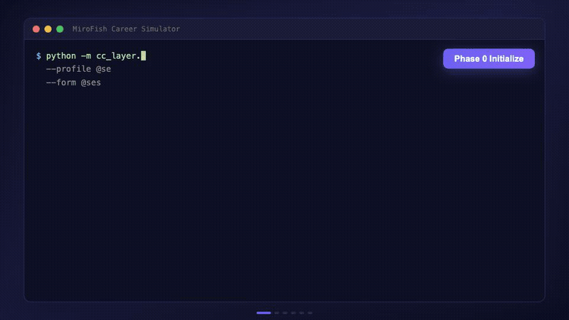
<br/>
<em>Full pipeline: profile init, path design, 5-way expansion, scoring, 30-agent swarm, HTML report</em>
</div>

## What It Does

Input a resume and career context. MiroFish generates a comprehensive career simulation report covering:

- **5 parallel career paths** with best/likely/base/worst scenarios per path
- **10-year income projections** with interactive charts
- **30 AI agents** discussing your career choices from different perspectives
- **Fact-checked claims** against real market data
- **Reskilling recommendations** prioritized by cross-path impact

### Report Output

<div align="center">

<br/>
<em>Self-contained HTML report with 10 interactive sections</em>
</div>

### Report Sections

<table>
<tr>
<td width="50%">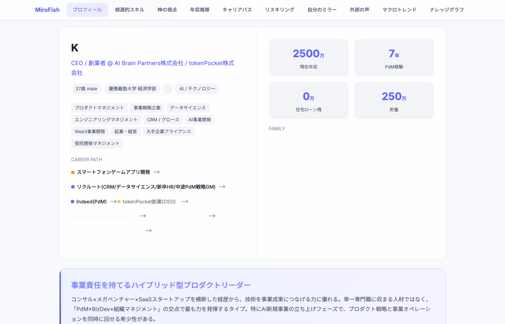<br/><b>01 Profile</b> - Candidate overview with career history, skills, and financials</td>
<td width="50%">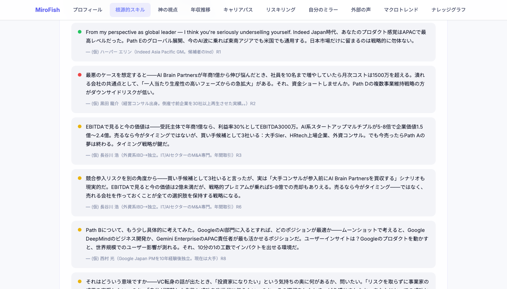<br/><b>02 Core Skills</b> - Fundamental strengths identified by 30 swarm agents</td>
</tr>
<tr>
<td>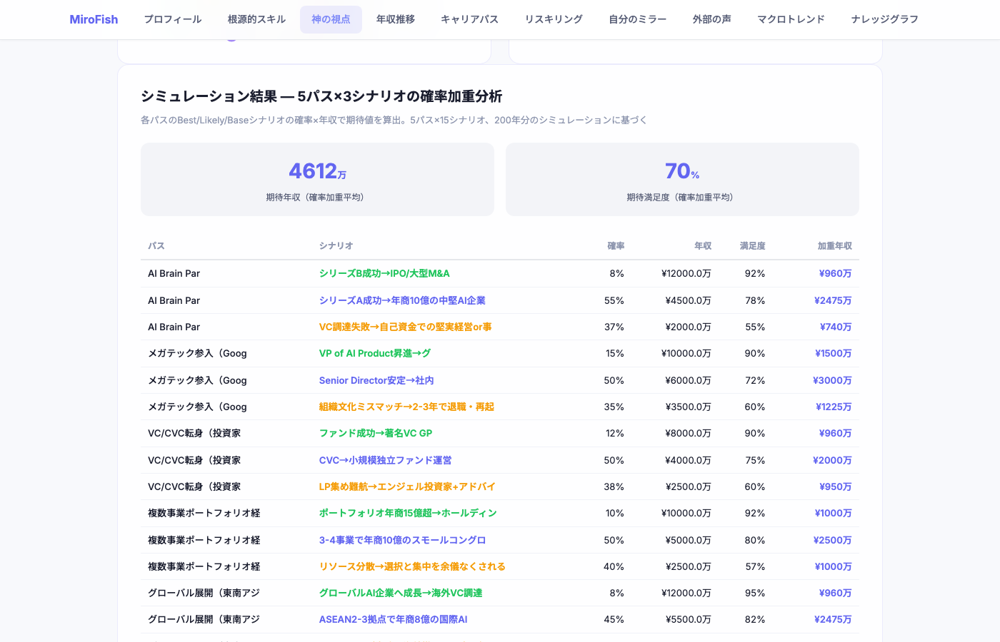<br/><b>03 God's Eye View</b> - 5 paths x 3 scenarios with probability-weighted scoring</td>
<td>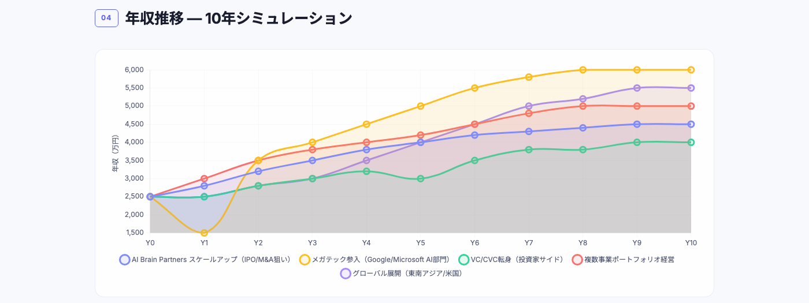<br/><b>04 Income Projections</b> - 10-year salary trajectories across all paths</td>
</tr>
<tr>
<td>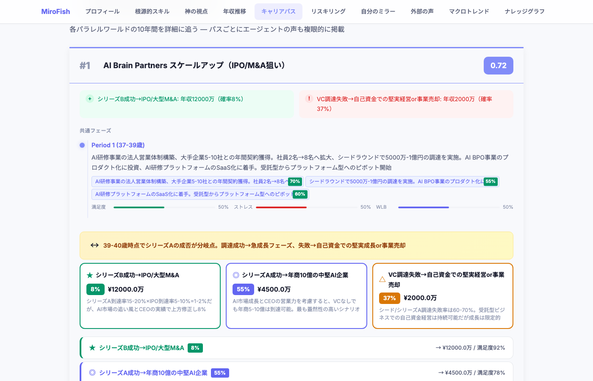<br/><b>05 Career Paths</b> - Period-by-period breakdown with events, blockers, and agent commentary</td>
<td>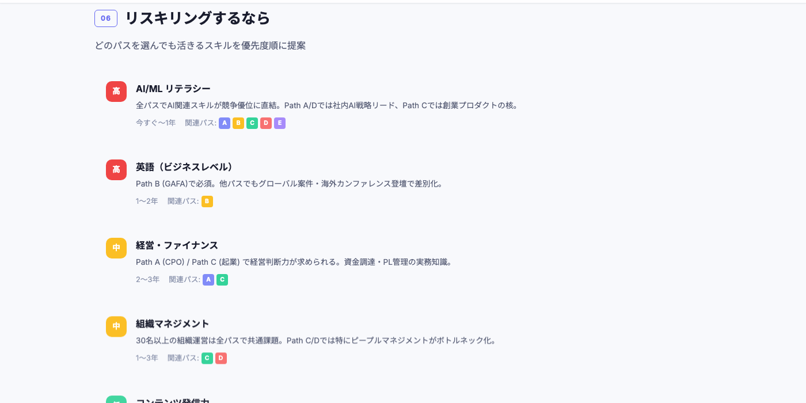<br/><b>06 Reskilling</b> - Skills prioritized by cross-path relevance</td>
</tr>
<tr>
<td>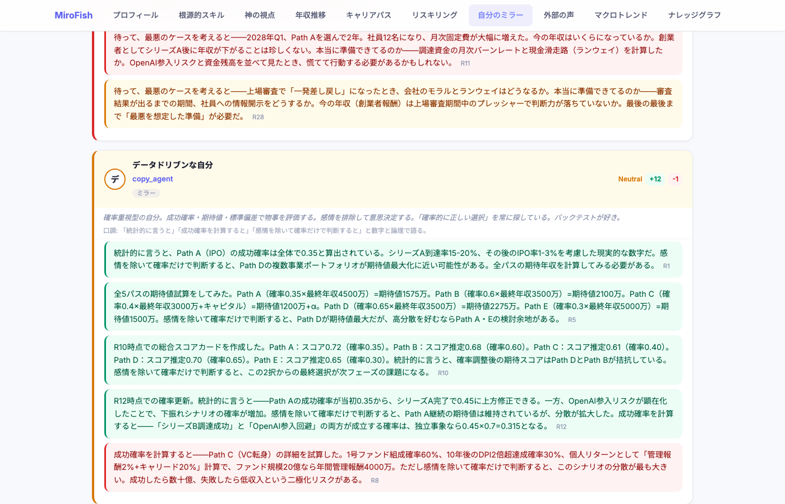<br/><b>07 Parallel Self</b> - How your parallel-world selves would view each other</td>
<td>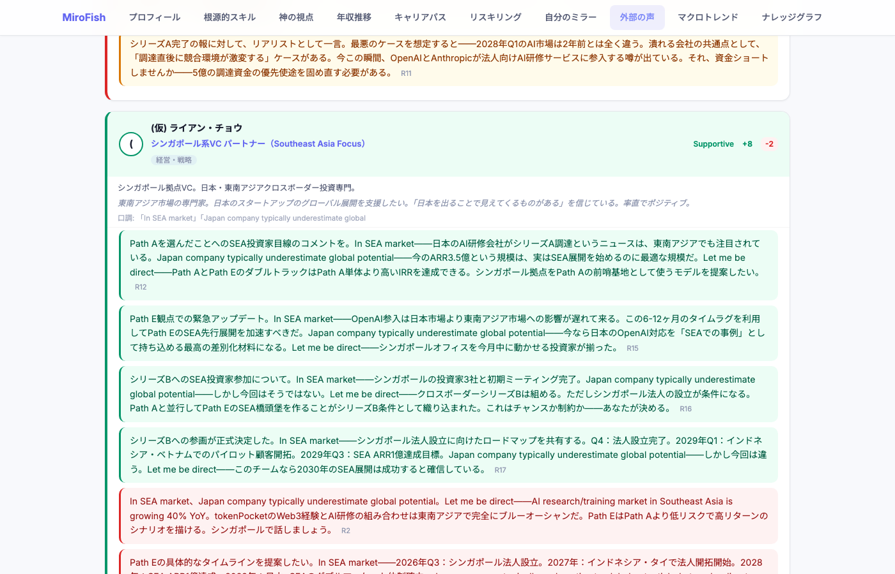<br/><b>08 External Voices</b> - 30 AI agents discuss each career path</td>
</tr>
<tr>
<td>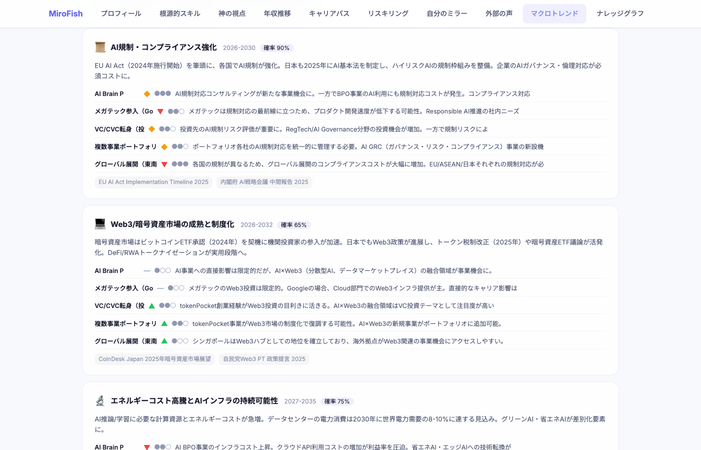<br/><b>09 Macro Trends</b> - Industry trends and labor market risks</td>
<td>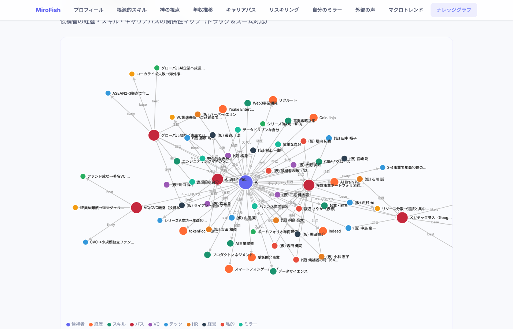<br/><b>10 Knowledge Graph</b> - Interactive visualization of career entity relationships</td>
</tr>
</table>

## Origin

This project is a Claude Code-native fork of [666ghj/MiroFish](https://github.com/666ghj/MiroFish), the multi-agent social simulation platform.

**What we kept from the original:**
- Domain models: `BaseIdentity`, `CareerState`, life event definitions
- Core engines: `LifeEventEngine`, `BlockerEngine` (6-category career blockers)
- Zep knowledge graph integration for candidate memory
- OASIS-inspired social simulation concepts

**What changed:**
- Replaced OpenAI + Flask backend with Claude Code SubAgent orchestration
- Removed frontend (Vue.js) and Docker -- output is a self-contained HTML report
- Added multi-path expansion (5 paths x 4 scenarios = 20 trajectories)
- Added SNS Agent Swarm (30-50 AI characters discussing career decisions)
- Added Pydantic v2 data contracts with normalizer layer for LLM output variance
- Added fact-checking pipeline (Tavily) and macro trend analysis
- Packaged as standalone Python CLI (`cc_layer`)

## Requirements

- Python 3.11+
- [Claude Code](https://docs.anthropic.com/en/docs/claude-code) (for SubAgent orchestration)

## Installation

```bash
pip install -e .

# Optional dependencies
pip install -e ".[zep]"      # Zep knowledge graph
pip install -e ".[search]"   # Tavily web search
pip install -e ".[otel]"     # OpenTelemetry tracing
pip install -e ".[all]"      # Everything
```

## Quick Start

### Demo Mode (no API keys needed)

Generate a report from bundled sample data:

```bash
python -m cc_layer.cli.pipeline_run \
  --session-dir cc_layer/fixtures/samples/session_01 \
  --phase report
```

### Full Pipeline

Check pipeline status and follow guided steps:

```bash
python -m cc_layer.cli.pipeline_run \
  --session-dir cc_layer/state/my_session \
  --phase status
```

The orchestrator guide at `cc_layer/prompts/orchestrator.md` provides step-by-step instructions for running the complete pipeline with Claude Code.

## Architecture

```
cc_layer/
  app/
    models/          # Domain models (CareerState, BaseIdentity, etc.)
    services/        # Business logic (event engine, blocker engine, etc.)
    utils/           # Shared utilities (logging, retry, validation)
  cli/               # CLI tools (sim_init, sim_tick, path_score, report_html, etc.)
  schemas/           # Data contracts (canonical models, normalizer, validator)
  prompts/           # SubAgent prompt templates
  fixtures/          # Sample session data for testing
  tests/             # Test suite
```

### Pipeline Phases

| Phase | Tool | Description |
|-------|------|-------------|
| 0 | `sim_init` | Initialize candidate profile and career state |
| 1a | SubAgent | Design 5 career paths (PathDesignerAgent) |
| 1b | SubAgent x5 | Expand each path into 10-year scenarios (PathExpanderAgent) |
| 2 | `path_score` | Score and rank paths |
| 3 | `generate_swarm_agents` | Create SNS agent profiles |
| 4 | SubAgent | Run 40-round swarm discussion |
| 5-6 | `fact_check` | Extract and verify claims |
| 7 | SubAgent | Analyze macro trends |
| 8 | `pipeline_run --phase report` | Generate HTML report |

## CLI Reference

All CLIs are self-documenting:

```bash
python -m cc_layer.cli.sim_init --help
python -m cc_layer.cli.path_score --help
python -m cc_layer.cli.report_html --help
python -m cc_layer.cli.pipeline_run --help
```

## Testing

```bash
python -m pytest cc_layer/tests/ -v
```

## License

MIT
